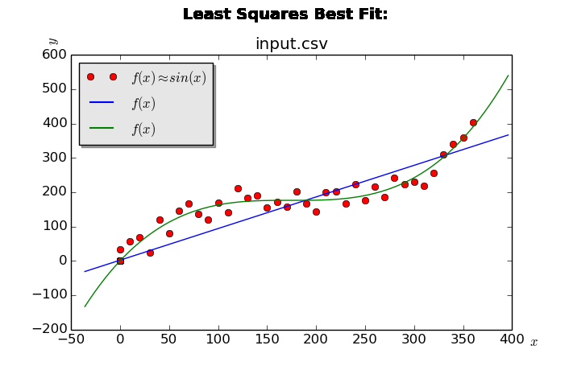

# Least Squares Curve Fit
This repository features a C++ and Python implementation of the least squares curve fitting technique. 

##Frontend
The Graphical User Interface (GUI) is written in *Python*, using the [Tkinter](https://docs.python.org/2/library/tkinter.html) and [Matplotlib](http://matplotlib.org/) libraries. I chose to write the frontend in Python for simplicity and for the purpose of faster development. A sample photo of the general output of the program follows:

##Backend
All of the functions that do the actual calculations are written in *C++* . I chose to write them in *C++* for a variety of reasons.

1. Speed. it is fast
2. Difficulty, it is more challenging to write 
3. I will port the algorithms to [CUDA C](http://www.nvidia.com/object/cuda_home_new.html) for even more optimization

All of the functions that do the calculations are written in the source code. This way, you can step through each phase of the process of the [least squares](https://en.wikipedia.org/wiki/Least_squares) algorithm. Note, this implementation is a proof of concept. 

##Dependencies
* C++
 * C11
 * Boost
* Python
 * Python3
 * Matplotlib
 * Tkinter
* User knowledge
 * Understanding of basic linear algebra
 * Intermediate experience with C-like programming languages

##Areas for improvement / Issues
*  Floats vs. Double
 * For an unknown reason, I cannot using double floating point numbers when attemppting to invert the matrix. This is a draw back because it means I cannot hold as large numbers, thus limiting the maximum and minimum input values, as well as putting a cap on the maximum order of magnitude for the fitted polynomial.
*  Compiling and Linking C++
 * I had a lot of trouble figuring out how to use third-party C++ code without using an IDE. I want the project to be IDE independent so that it can be easily opened on any platform. It is also a good exercise to learn how some of these such as linking and compiling work. As a primary Java developer, I take for granted things suchas simple import statements, having a more robust standard library, and tools such as gradle for easy dependency management. Through doing this project entirely out of an IDE, I have learned that I have a lot to learn as a programmer.
* Understanding the Operating System (OS)
 * C++ can behave very differently depending on OS that is being used. Again, as a Java developer, I enjoy the liberty of coding in a platform independent language, and not worrying about how my code will behave under another OS. I found that it was particularly difficult to develop with on Linux Ubuntu when it came to the part where I needed 3rd party libraries. Not understanding the system architecture made it very challenging to following basic installation tutorials. From this, I have realized that a developer must have a good idea about the architecture of the platform they are developing on and for.